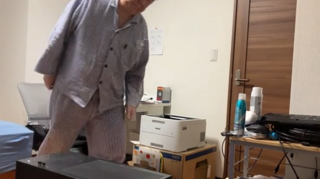
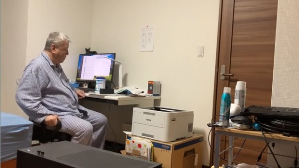
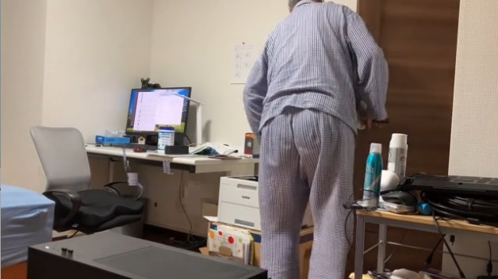
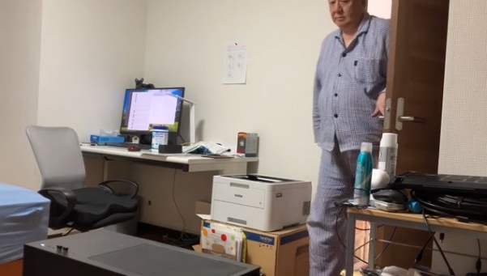
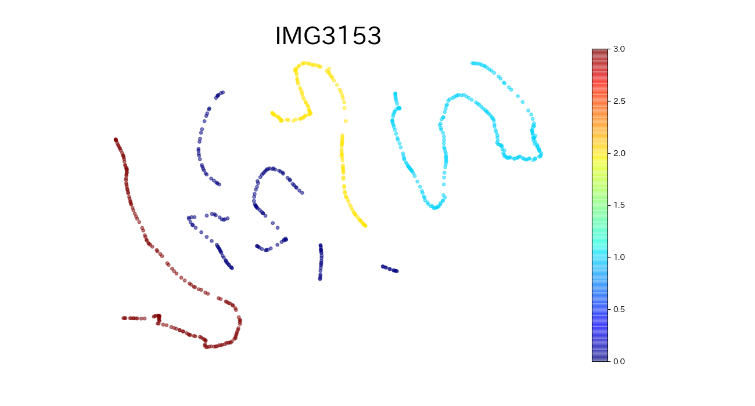
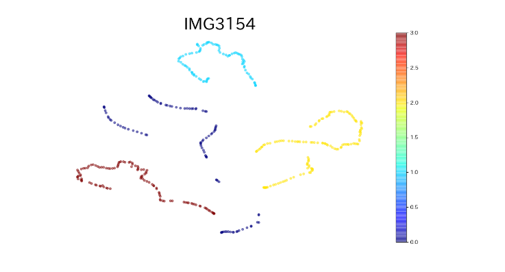

# generate_tsne
json files and movie files convert to the t-sne figures.  (Using i3D features)  
Label file is needed.(label_define.json)  
I3D pre-trained model was taken from `https://github.com/hassony2/kinetics_i3d_pytorch`　　
***    
This repository is a copy of the following repository, so please follow the repository below for usage.  
The only file unique to this repository is 'generate_tsne.py'.  
https://github.com/v-iashin/video_features  
***
'tsnecuda' is required for 'generate_tsne.py' to work in this repository.  
We recommend conda for the operating environment.  
https://github.com/CannyLab/tsne-cuda  
***  
This repository requires NVIDIA GPU and CUDA11.3 environment.   
I haven't tested it in other environments.  
The NVIDIA GPU I tested is the RTX4080.  
***   
I am in the test video.  

***  
# Input movie and results  
Walking  

Sitting  

Exit  

Enter  

\*\*\*  
# Results  
 

